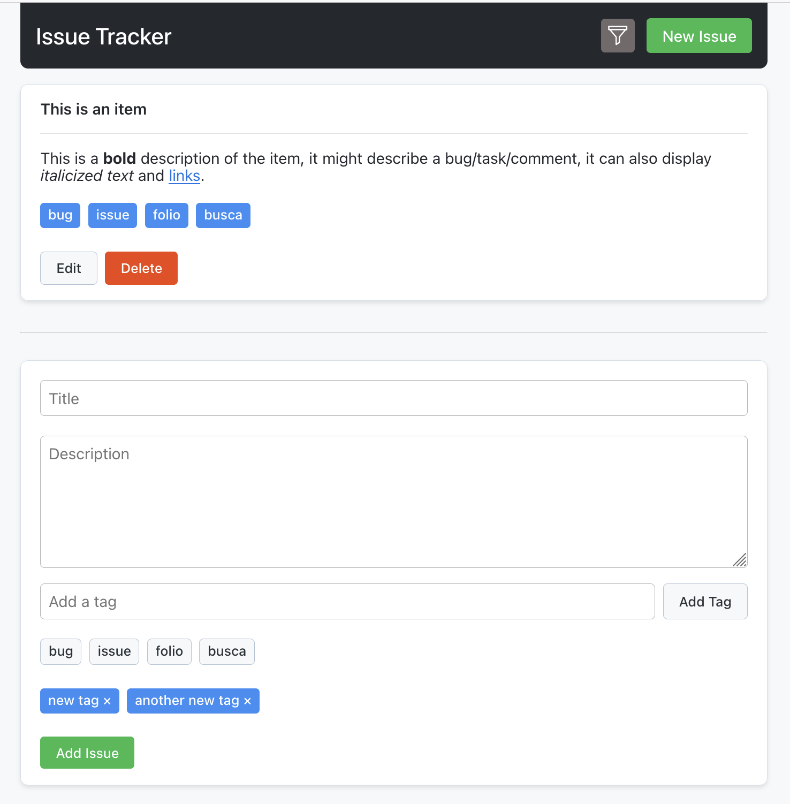
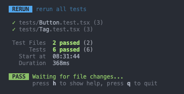

## Issue Tracker

---

Built with Vite, React, TS, SCSS and Vitest for testing.



### Live demo

Demo available at [https://cool-issue-tracker.vercel.app](https://cool-issue-tracker.vercel.app)

### Installation

1. Clone the repository:

   ```bash
   git clone https://github.com/zoltantothcom/issue-tracker
   ```

2. Change into the project directory:

   ```bash
   cd issue-tracker
   ```

3. Install the dependencies:

   ```bash
   npm i
   ```

4. Start the development server:

   ```bash
   npm run dev
   ```

5. Open [http://localhost:5173](http://localhost:5173) to see the result.

### Running the tests

```bash
npm test
```


